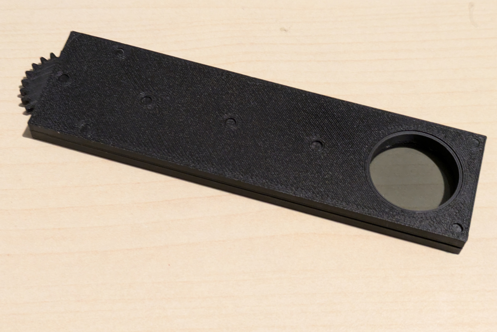
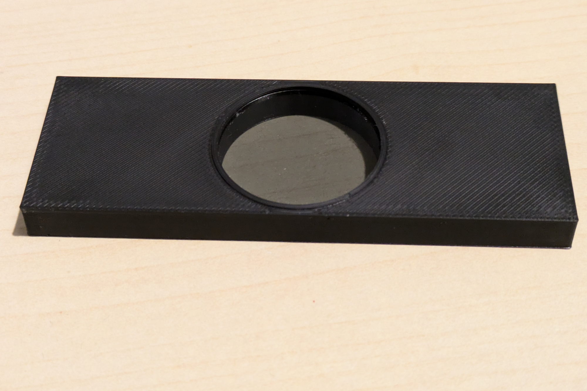
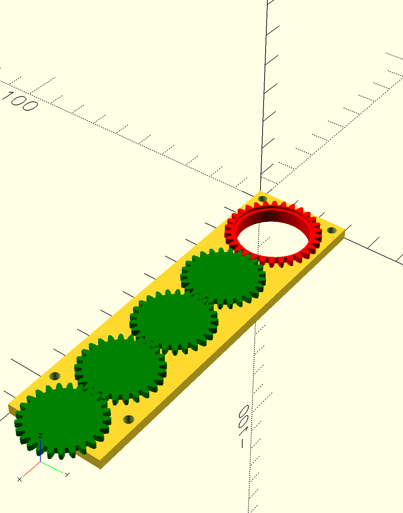
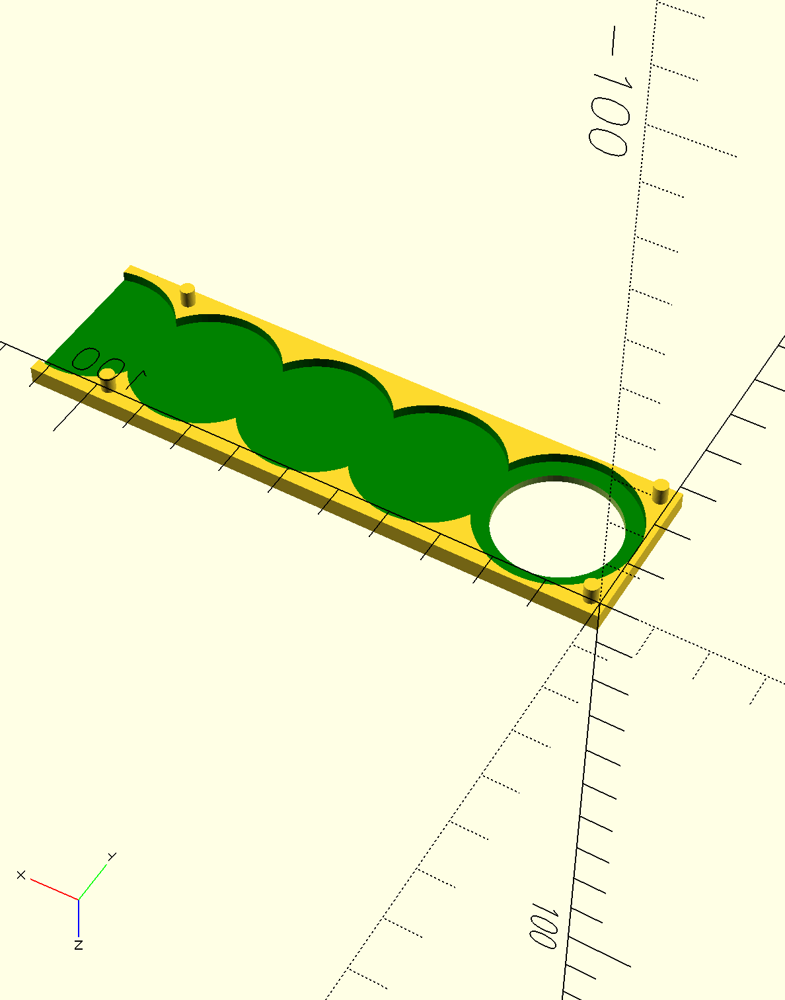

# Olympus BX60 Polarisers

Plastic analyser and polariser housing for Olympus BX60.  Designed
to be used in place of U-AN360 and U-PO.  Printed in PLA using A1 mini.

Makes use of https://github.com/BelfrySCAD/BOSL2 for the gears, which
you will need to have included with OpenSCAD.

See https://www.youtube.com/watch?v=c8nM4Z-hkTw were I made use of this analyser and polariser.

